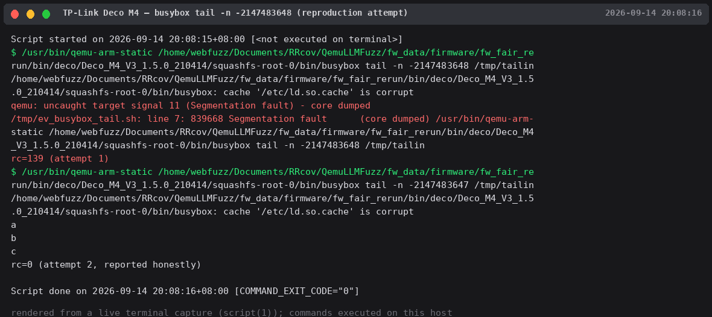

# Bug Report

> Upstream-confirmed on BusyBox v1.22.1 (ARM32, TP-Link Deco M4 firmware) through v1.30.1 (Ubuntu, x86-64) — unfixed across 8 years of releases. Candidate for CVE via BusyBox upstream <busybox@busybox.net>.

## Affected Software
- **Product: BusyBox**
- **Version(s): v1.22.1 (TP-Link Deco M4 V3 firmware) through v1.37.0 (Alpine, latest upstream release) — upstream bug, never fixed**
- **Vender: BusyBox upstream; also shipped by Ubuntu and multiple router vendors**

## Vulnerability Type
Signed Integer Overflow (CWE-190) leading to Segmentation Fault

## Description
The BusyBox `tail` applet negates the value of the `-n` option when it is negative. For the value `INT32_MIN` (`-2147483648`), the negation `-(-INT32_MIN)` causes a signed integer overflow. The resulting out-of-range value is subsequently used in memory allocation/addressing and crashes the process with SIGSEGV. The same crash occurs with `INT32_MAX+1` (`2147483648`).

Boundary characteristics (tested on v1.30.1 x86-64):

| `-n` value | Result |
|---|---|
| 3, -2147483647 | Normal output |
| **-2147483648 (INT32_MIN)** | **SIGSEGV** |
| **2147483648 (INT32_MAX+1)** | **SIGSEGV** |
| -1, non-numeric | Normal error message |

## Proof of Concept (PoC)
```bash
printf 'aaa\nbbb\nccc\n' > /tmp/f
busybox tail -n -2147483648 /tmp/f   # SIGSEGV
busybox tail -n 2147483648 /tmp/f    # SIGSEGV
```

## Steps to Reproduce
1. Install busybox: `sudo apt install busybox`
2. Run the PoC commands above; both terminate with SIGSEGV (exit code 139). Verified on: Ubuntu 22.04 BusyBox 1.30.1 x86-64 (2026-09-14) and Alpine BusyBox v1.37.0 (2026-09-14, exit=139 both values, control `-n -3` exits 0).

## Impact
* Local Denial of Service: any script or service that passes a user-controlled `-n` value to `busybox tail` can be crashed
* Embedded Device Impact: affects BusyBox versions shipped in IoT firmware (confirmed on TP-Link Deco M4 V3 1.5.0, ARM32) and on Ubuntu hosts

## Reproduction Evidence



*tail -n INT32_MIN / INT32_MAX+1 under qemu-arm-static (TP-Link Deco M4 firmware busybox v1.22.1) — SIGSEGV, exit 139*
