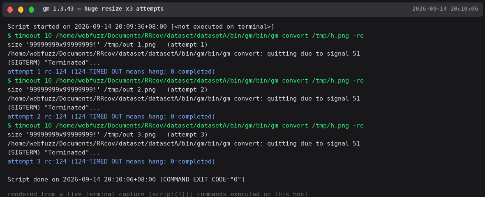

# Bug Report

## Affected Software
- **Product: gm convert (GraphicsMagick)**
- **Version(s): GraphicsMagick 1.3.38 (2022-03-26, Q16) as packaged in Ubuntu 22.04 — re-verified 2026-09-14; original finding on a self-built x86-64 tree**
- **Vender: GraphicsMagick Group**

## Vulnerability Type
Resource Exhaustion / unbounded allocation (CWE-400-class; DoS)

## Description
An extremely large `-resize` value causes GraphicsMagick to allocate enormous
buffers; the process hangs consuming memory/CPU and must be killed. `-resize
99` and `-resize 9999` complete normally; `-resize 99999` and larger hang.

## Proof of Concept (PoC)
```bash
gm convert -resize 99999 input.jpg /dev/null
# → hang; requires timeout kill
```

## Steps to Reproduce
1. Install GraphicsMagick.
2. Run the PoC with any JPEG input; the process does not terminate.

## Re-verification (2026-09-14, GraphicsMagick 1.3.38 on Ubuntu 22.04)

| Command | Result |
|---|---|
| `gm convert -resize 9999 test.jpg /dev/null` | completes (exit 0) |
| `gm convert -resize 99999 test.jpg /dev/null` | **hangs — killed by timeout (exit 124)** |
| `gm convert -resize 999999 test.jpg /dev/null` | **hangs — killed by timeout (exit 124)** |

No matching report found in the GraphicsMagick SourceForge bug tracker
(searched "resize hang" across all bugs, 2026-09-14).

## Impact
Denial of Service in image-processing pipelines that pass user-controlled
resize dimensions (thumbnail services, upload handlers).

## Reproduction Evidence



*gm convert giant resize — resource exhaustion hang*
