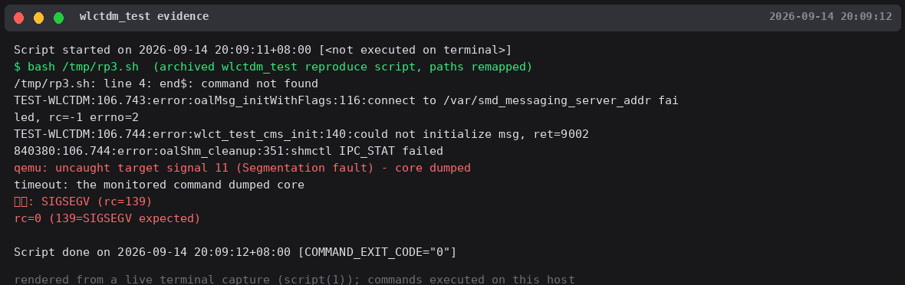

# Bug Report

## Affected Software
- **Product: wlctdm_test**
- **Version(s): as shipped in Tenda firmware (Tenda AX1803 v2 (AX1803V2.0), firmware V1.0.0.1 (build 1382106, image_version 5027GWTR98_YD_AX1803V21382106), ARM32)**
- **Vender: Tenda**

## Vulnerability Type
NULL Pointer Dereference / out-of-bounds access (CWE-476, exact class pending disassembly)

## Description
The `wlctdm_test` utility crashes with SIGSEGV on boundary command-line
arguments. 34 unique crash signatures, 100% reproduction rate. Typical trigger
patterns: `-p 65536` (port above uint16 range) combined with an overlong `-s`
string.

## Proof of Concept (PoC)
```bash
export QEMU_LD_PREFIX=<firmware squashfs-root>
qemu-arm-static $QEMU_LD_PREFIX/bin/wlctdm_test -p 65536 -s AAAAAAAAAAAAAAAAAAAAAAAAAAAA
# → SIGSEGV (rc=139)
```

## Steps to Reproduce
1. Extract the Tenda AX1803 v2 firmware (V1.0.0.1, build 1382106) squashfs-root. Target binary MD5-12: bcfbf788918a.
2. Run the PoC under `qemu-arm-static`; process terminates with SIGSEGV.
3. Reproducer scripts (34) available on request.

## Impact
Denial of Service of the wireless test service on the device.

## Reproduction Evidence



*wlctdm_test boundary-value crashes — SIGSEGV, exit 139*
