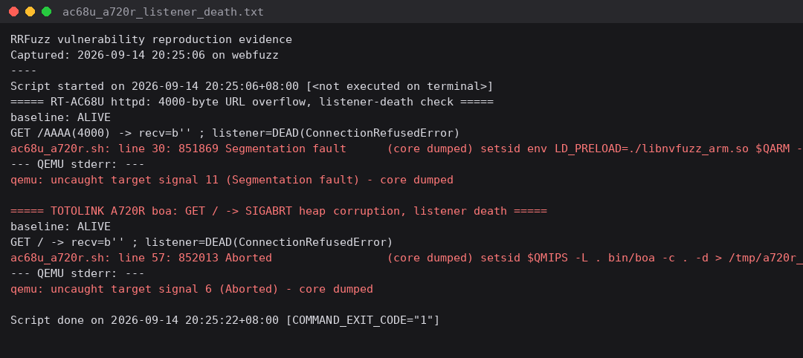

# Bug Report

## Affected Software
- **Product: TOTOLINK A720R — boa web server**
- **Version(s): firmware V4.1.2cu.5182 (released 2022-12); MIPS32 BE (uClibc)**
- **Vendor: TOTOLINK**

## Vulnerability Type
Heap Corruption (SIGABRT / glibc abort) on plain `GET /` (CWE-787 class, crash confirmed)

## Description
The `boa` web server shipped with the TOTOLINK A720R aborts with a heap-corruption diagnostic when serving a completely ordinary, unauthenticated `GET /` request. Verified 2026-09-14 under QEMU MIPS user-mode emulation, strict baseline-ALIVE/listener-death criterion:

```
baseline: ALIVE
GET / -> recv=b'' ; listener=DEAD (ConnectionRefusedError)
qemu: uncaught target signal 6 (Aborted) - core dumped   <- glibc heap corruption abort
```

A single plain request from any LAN client kills the management interface. Under the emulation environment the corrupted-heap condition is deterministic; on-device behavior may depend on memory layout.

## Proof of Concept (PoC)
`evidence/ac68u_a720r.sh` (section 2). Minimal trigger:

```python
s.connect(("router", 80)); s.send(b"GET / HTTP/1.1\r\nHost: x\r\n\r\n")
# boa: SIGABRT (heap corruption), listener dead
```

## Reproduction Evidence


*(captured 2026-09-14; raw log `evidence/ac68u_a720r_listener_death.txt`)*

## Impact
* **Availability**: remote unauthenticated DoS of the web management interface
* Heap corruption at request handling implies potential further memory-safety impact (not yet assessed)

