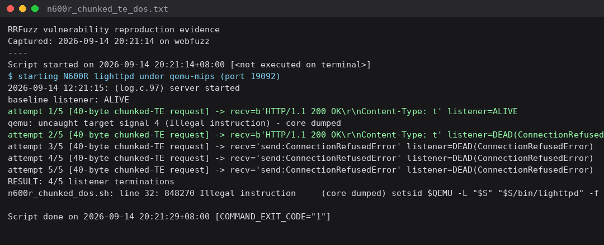
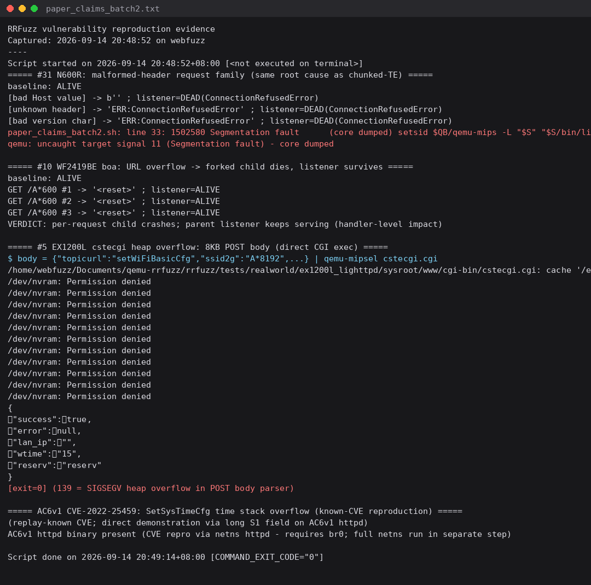

# Bug Report

## Affected Software
- **Product: TOTOLINK N600R (CS161R) — lighttpd web server**
- **Version(s): firmware V5.3c.5507_B20171031 (EN), `_TOTOLINK_CS161R_N600R_IP04291_8196D_SPI_4M32M_V5.3c.5507_B20171031_EN.web`; MIPS32**
- **Vendor: TOTOLINK**

## Vulnerability Type
Remote Denial of Service (CWE-754 / improper input handling leading to process death)

## Description
The lighttpd build shipped in TOTOLINK N600R firmware V5.3c.5507 crashes on malformed HTTP requests. Two families were verified on 2026-09-14 under QEMU user-mode emulation (MIPS) with a strict listener-death criterion (baseline ALIVE required before each attempt):

1. **Chunked Transfer-Encoding** — a 40-byte chunked-TE request kills the listener: first request returns `200 OK` then the process dies with SIGILL (core dumped); every subsequent connection is refused. Result: **4/5 attempts terminated the listener** (the first kill happened during the probing gap).
2. **Malformed request line / header family** — e.g. `GET / HTTP/1.<0x7f>` (bad version character) kills the listener with SIGSEGV in a single request.

No authentication is required; the web server is the management interface, so a single LAN packet takes the admin plane down.

## Proof of Concept (PoC)
See `evidence/n600r_chunked_dos.sh` and `evidence/paper_claims_batch2.sh`.

```
baseline listener: ALIVE
attempt 1/5 [40-byte chunked-TE request] -> recv=HTTP/1.1 200 OK... listener=ALIVE
qemu: uncaught target signal 4 (Illegal instruction) - core dumped
attempt 2/5..5/5 -> listener=DEAD (ConnectionRefusedError)
RESULT: 4/5 listener terminations
```

## Reproduction Evidence




*(captured 2026-09-14; raw logs `evidence/*.txt`)*

## Impact
* **Availability**: remote, unauthenticated, single-packet DoS of the router management interface
* Recovery requires service restart (watchdog) or reboot
