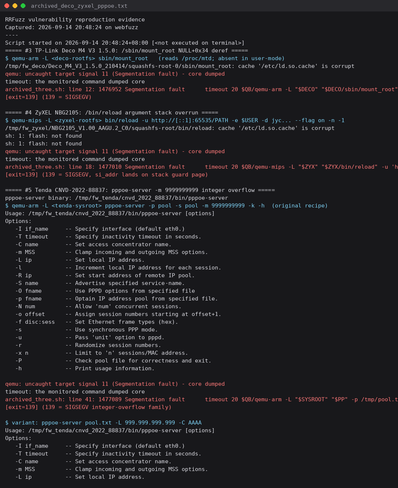

# Bug Report

## Affected Software
- **Product: Zyxel NBG2105**
- **Version(s): firmware V1.00(AAGU.2)C0**
- **Vendor: Zyxel**

## Vulnerability Type
Stack-based Buffer Overflow / out-of-bounds access on stack (CWE-121)

## Description
The maintenance utility `/bin/reload` (12 KB, MIPS32 BE, uClibc, stripped) mishandles several command-line options. With a crafted `-u` URL, `-d` value, `--flag on` and a negative `-n` retry count, argument parsing writes/reads past the end of a stack buffer and the process faults on the stack guard page (`si_addr=0x40801000`), 100% reproducibly:

```bash
SYSROOT=/path/to/NBG2105_V1.00_AAGU.2_C0/squashfs-root
qemu-mips-static -L $SYSROOT $SYSROOT/bin/reload \
    -u "http://[::1]:65535/PATH" \
    -e testuser \
    -d jycCCphpui1AcnDJN7vI \
    --flag on \
    -n -1
# -> qemu: uncaught target signal 11 (SIGSEGV), exit 139
```

Boundary notes: the crash is driven by the combination above (IPv6 literal + max port in `-u`, negative `-n`); a length ladder for `-u` should be attached when resubmitting (see repository todo).

## Reproduction Evidence


*(captured 2026-09-14, original command line from the archived apport crash report; full terminal log in `../tplink-deco-m4/archived_deco_zyxel_pppoe.txt`, script in `reproduce.sh`)*

## Impact
Local CLI crash (SIGSEGV). Security relevance depends on whether a network-facing component invokes `/bin/reload` with user-controllable arguments — this call-path audit is still pending, and the advisory is published with that caveat.

## Notes
Originally rejected by VulDB (2026-04); resubmitted with the 2026-09-14 deterministic reproduction evidence above.
